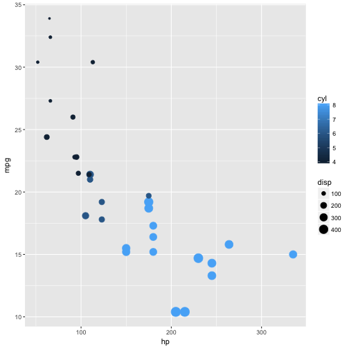

Affect on MPG
========================================================
author: Shivam Patel
date: August 19, 2017
autosize: true

Intro
========================================================

This product is targeted towards automakers. With the fuel economy always changing, they must do what they can to minimize MPG. 

The Idea
========================================================

We hope to provide them with an estimate of what it would be if they configured some of the following variables.  

- Displacement
- Horsepower
- Cylinders

Visual
========================================================

We use the mtcars dataset. We can see that there is mostly a linear affect between these variables



How It Works
========================================================

The user simply provides the necessary info and a prediction is made.


```r
disp=150; hp=150; cyl=4
predict(lm(mpg ~ cyl + disp + hp, mtcars), data.frame(disp=disp, hp=hp, cyl=numeric(cyl)))[[1]]
```

```
[1] 29.15731
```

